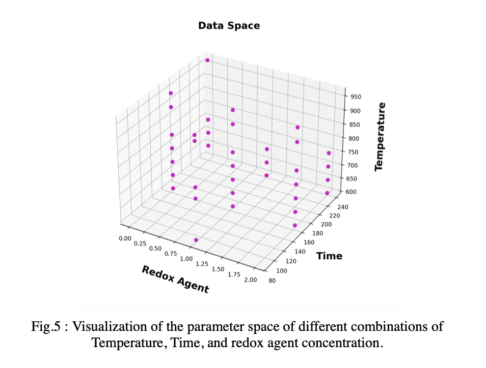
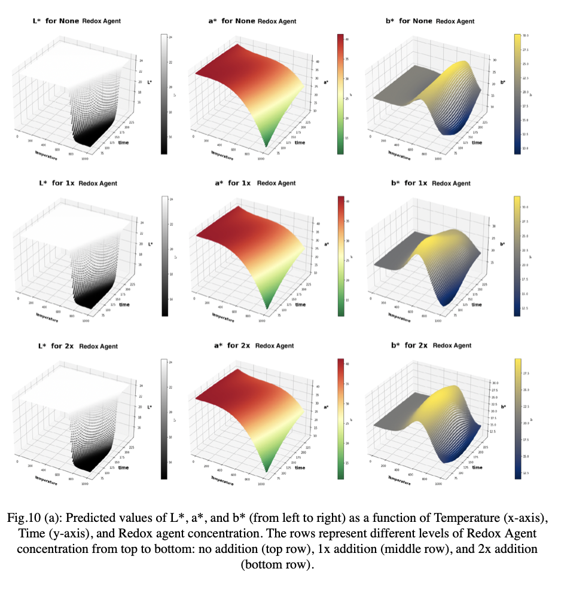

# 🎨 **Prediction and Optimization of Red Iron Oxide Pigments**

This project is based on the article titled **"Prediction and Optimization of Red Iron Oxide"**. In this study, we synthesize red iron oxide pigments from mill scale through a simple, economical, and environmentally friendly method. The project explores how synthesis parameters influence pigment color using machine learning.

## 📌 Project Overview

The study demonstrates how varying synthesis conditions can optimize the production of red iron oxide pigments. Key process parameters include:
- **Oxidizing agent content**
- **Calcination time and temperature**

🧬 To synthesize red iron oxide pigments:
1. Mill scale is reacted with sulfuric acid to achieve ferrous sulfate (FeSO₄·XH₂O).
2. The ferrous sulfate is oxidized with sodium nitrate at varying amounts.
3. The mixture is calcined at different temperatures and times to produce pigments of different red shades.

The resulting powders were characterized using:
- X-ray Diffraction (XRD)
- Scanning Electron Microscope (SEM)
- Dynamic Light Scattering (DLS)

It was observed that the amount of oxidizing agent, calcination time, and temperature affect particle size and morphology, leading to different shades of red.

## 🤖 Machine Learning Approach

Six supervised machine learning models were employed to predict the color values (L*, a*, b*) based on process parameters:
- **Support Vector Machine (SVM)🥇**
- **Random Forest (RF)**
- **Linear Regression (LR)**
- **Multilayer Perceptron (MLP)**
- **Decision Tree (DT)**
- **K-Nearest Neighbors (KNN)**

Using seven-fold cross-validation, the **SVM model** achieved the highest predictive accuracy with a Mean Absolute Percentage Error (MAPE) of 87.92%.

## 📂 Repository Contents

- **Main.py**: Script for data preprocessing, cleaning, and training all six machine learning models with grid search.
- **Result_Graph.py**: Script to generate all visualizations, including:
  - Parameter space exploration
  - Statistical descriptive plots
  - 3D plot of best model predictions
- **Experimental_data.xlsx**: Dataset used in the study.
- **Hyper_Parameters_Space.py**: Defines hyperparameter ranges for each model.
- **Best_Hyperparameters_for_MLP.py**: Optimal hyperparameters for the Multilayer Perceptron model.
- **Best_Hyperparameters_for_SVM.py**: Optimal hyperparameters for the Support Vector Machine model.


## 🚀 Installation and Usage

1. **Clone the repository**:
   ```bash
   git clone https://github.com/APMaii/Prediction-of-colors-value-of-red-iron-oxide-pigments
   ```
2. **View experimental data**: See `experimental_data.xlsx` for raw data from the synthesis process.

  
3. **Run main.py** to preprocess data and train models:
   ```bash
   python main.py
   ```

4. **Generate visualizations** with result_graph.py:
   ```bash
   python result_graph.py
   ```


## 🎯 Results

The SVM model proved effective in predicting color values (L*, a*, b*) across various process parameters, demonstrating an average MAPE of 87.92%. The findings highlight the impact of calcination temperature, oxidizing agent content, and calcination time on color outcomes.


## 📊 Visualizations

#### Parameter Space Plot 🗺️
This plot shows the distribution and relationships of input parameters across the dataset.



#### Final Prediction 3D Plot 📈
This 3D plot illustrates the SVM model's color predictions across various parameter configurations.



## 📜 License

This project is licensed under the MIT License. See the `LICENSE` file for more details.
