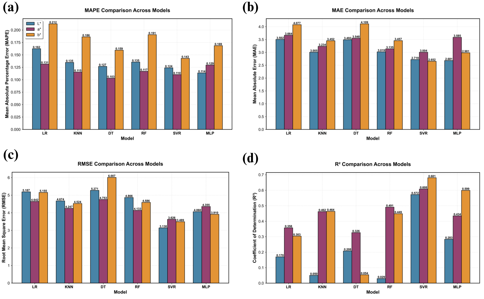
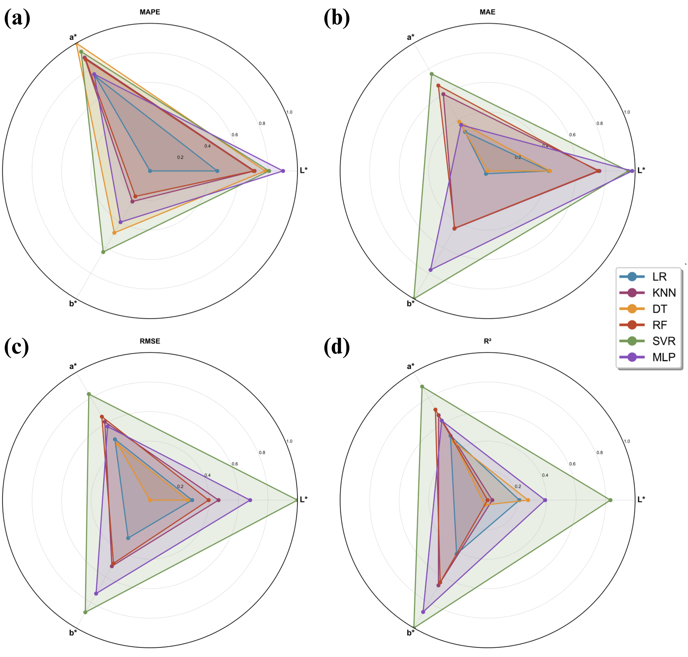
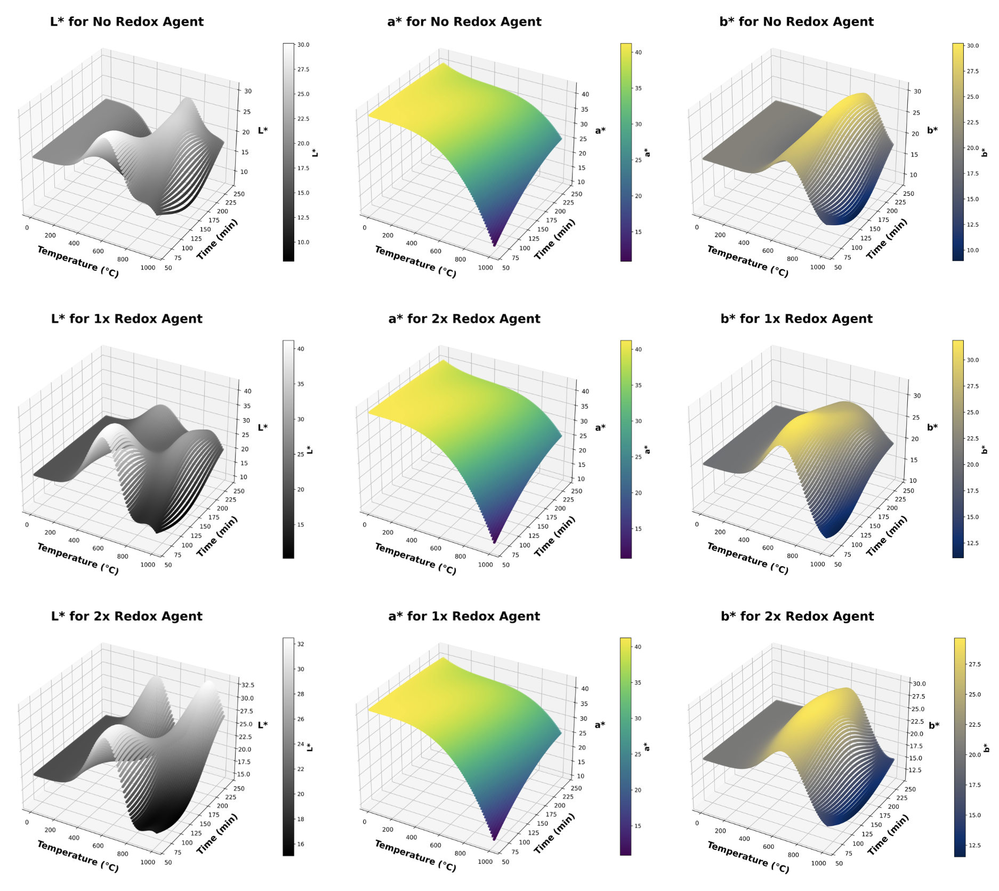
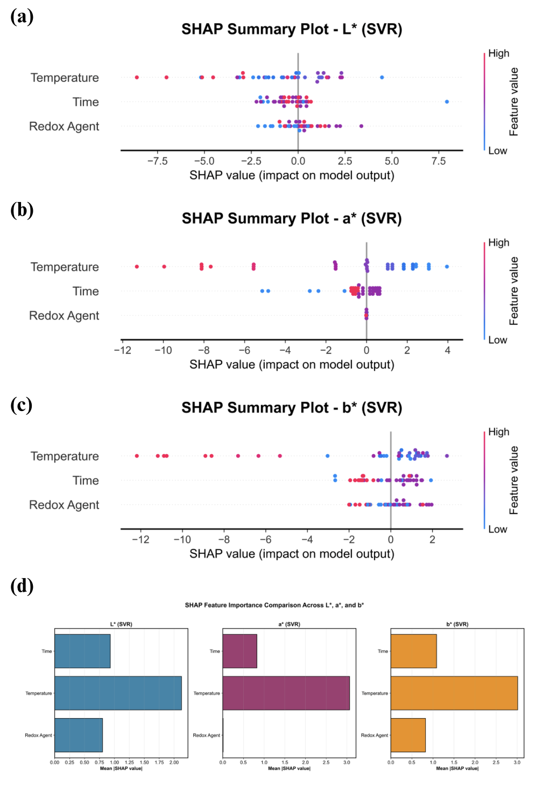

# Prediction and Optimization of Red Iron Oxide Pigments

This repository contains the implementation of a machine learning-based approach for predicting and optimizing red iron oxide pigment synthesis parameters. The work is based on research that synthesizes red iron oxide pigments from mill scale using a cost-effective and environmentally friendly methodology.

## Project Overview

This study investigates the relationship between synthesis parameters and the resulting color properties of red iron oxide pigments. The research employs machine learning techniques to model and predict color values (L*, a*, b*) based on key process variables, enabling optimization of pigment production.

### Synthesis Methodology

The synthesis process involves three primary steps:

1. **Reaction**: Mill scale is reacted with sulfuric acid to produce ferrous sulfate (FeSO₄·XH₂O)
2. **Oxidation**: The ferrous sulfate is oxidized with sodium nitrate at varying concentrations
3. **Calcination**: The mixture undergoes calcination at different temperatures and durations to yield pigments with varying red shades

### Process Parameters

The key variables investigated in this study include:
- **Oxidizing agent content** (sodium nitrate concentration)
- **Calcination temperature**
- **Calcination time**

### Material Characterization

The synthesized powders were characterized using:
- X-ray Diffraction (XRD) for phase identification
- Scanning Electron Microscopy (SEM) for morphological analysis
- Dynamic Light Scattering (DLS) for particle size distribution

Results indicate that oxidizing agent content, calcination time, and temperature significantly influence particle size, morphology, and consequently, the resulting color properties of the pigments.

## Machine Learning Approach

Six supervised machine learning algorithms were evaluated for predicting color values (L*, a*, b*) from process parameters:

- **Support Vector Machine (SVM)** - Best performing model
- **Random Forest (RF)**
- **Linear Regression (LR)**
- **Multilayer Perceptron (MLP)**
- **Decision Tree (DT)**
- **K-Nearest Neighbors (KNN)**

Model evaluation was performed using seven-fold cross-validation. The Support Vector Machine model demonstrated superior performance, achieving a Mean Absolute Percentage Error (MAPE) of 87.92%.

## Repository Contents

### Core Scripts

- **`Main.py`**: Primary workflow script that performs data preprocessing, feature scaling, and trains all six machine learning models using grid search cross-validation. Generates model performance metrics and saves trained models.

- **`EDA_Graph.py`**: Visualization script that generates comprehensive plots including parameter space exploration, statistical descriptive plots, model performance comparisons, and prediction visualizations.

- **`Prediction_Graph.py`**: Script for generating prediction plots and model comparison visualizations.

- **`SHAP_Analysis.py`**: Implements SHAP (SHapley Additive exPlanations) analysis for model interpretability and feature importance evaluation.

- **`Metric_results.py`**: Calculates and displays comprehensive performance metrics for all models.

### Configuration Files

- **`Hyper_parameters_Space.py`**: Defines the hyperparameter search space for each machine learning model used in grid search optimization.

- **`Best_Hyperparameters_for_MLP.py`**: Contains the optimal hyperparameter configuration for the Multilayer Perceptron model.

- **`Best_Hyperparameters_for_SVM.py`**: Contains the optimal hyperparameter configuration for the Support Vector Machine model.

### Data Files

- **`Experimental_data.xlsx`**: Experimental dataset containing synthesis parameters and corresponding color measurements (L*, a*, b* values).

- **`METRICS_DATA.xlsx`**: Compiled performance metrics for all evaluated models.

### Additional Files

- **`Practcial Main.py`**: Practical implementation script for model deployment and predictions.

## Installation and Usage

### Prerequisites

Ensure you have Python 3.x installed along with the following packages:
- pandas
- numpy
- scikit-learn
- matplotlib
- seaborn
- openpyxl (for Excel file handling)
- shap (for SHAP analysis)

### Setup

1. **Clone the repository**:
   ```bash
   git clone https://github.com/APMaii/Prediction-of-colors-value-of-red-iron-oxide-pigments
   cd Prediction-of-colors-value-of-red-iron-oxide-pigments
   ```

2. **Install required dependencies**:
   ```bash
   pip install pandas numpy scikit-learn matplotlib seaborn openpyxl shap
   ```

### Usage

1. **Data Preprocessing and Model Training**:
   ```bash
   python Main.py
   ```
   This script will:
   - Load and preprocess the experimental data
   - Train all six machine learning models with hyperparameter optimization
   - Generate performance metrics
   - Save trained models

2. **Generate Visualizations**:
   ```bash
   python Result_Graph.py
   ```
   This generates comprehensive visualizations including parameter space plots, statistical analyses, and model performance comparisons.

3. **SHAP Analysis** (optional):
   ```bash
   python SHAP_Analysis.py
   ```
   Performs SHAP analysis to interpret model predictions and feature importance.

## Results

The Support Vector Machine model demonstrated superior predictive performance in estimating color values (L*, a*, b*) across various process parameter configurations. The model achieved an average MAPE of 87.92% using seven-fold cross-validation. The analysis revealed significant relationships between calcination temperature, oxidizing agent content, and calcination time with the resulting color properties of the pigments.

## Visualizations

### Model Performance Metrics

The following figure presents comprehensive performance metrics comparing all six machine learning models across multiple evaluation criteria.



### Spider Plots

Spider plots (radar charts) provide a multi-dimensional comparison of model performance across different metrics, enabling visual assessment of each model's strengths and weaknesses.



### Prediction Plots

Prediction plots illustrate the relationship between actual and predicted color values, demonstrating model accuracy and prediction quality across the dataset.



### SHAP Analysis

SHAP (SHapley Additive exPlanations) analysis provides interpretability insights, showing the contribution of each input feature to the model's predictions. This analysis helps understand which process parameters most significantly influence color outcomes.



### Parameter Space Exploration

The parameter space plot visualizes the distribution and relationships of input parameters across the experimental dataset, providing insight into the design space coverage.


## License

This project is licensed under the MIT License. See the `LICENSE` file for more details.

## Citation

If you use this code or methodology in your research, please cite the original article: "Prediction and Optimization of Red Iron Oxide"

## Contact

For questions or inquiries regarding this project, please open an issue in the repository.
